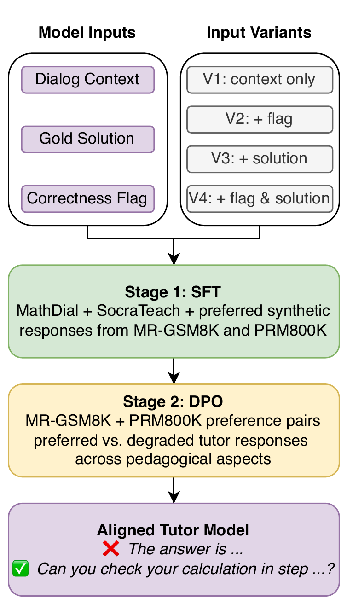

# Towards Aligned Math Tutor

Code and data for the paper **Towards Pedagogically Aligned LLM Tutors for Math Mistake Remediation**.

[Kseniia Petukhova](https://scholar.google.com/citations?user=XsiLKJcAAAAJ&hl=en&oi=ao), [Tien Dat Nguyen](https://scholar.google.com/citations?user=R63K4U4AAAAJ&hl=en), [Ekaterina Kochmar](https://ekochmar.github.io/about/)

## Abstract

Large language models have strong potential for use in intelligent tutoring systems, but they often fail to follow effective pedagogical strategies, such as guiding students without revealing final answers. We study the application of a two-stage alignment pipeline for math mistake remediation, combining supervised fine-tuning on tutoring dialogs with Direct Preference Optimization on synthetic preference pairs. We construct a dataset that integrates existing tutoring corpora with synthetic data generated along pedagogical dimensions, such as scaffolding and factuality, and study different input configurations that incorporate solution correctness and gold answers. Experiments show that this approach improves both factual accuracy and pedagogical quality over base models and existing tutoring models. Human evaluation further indicates that our best model is competitive with a strong proprietary baseline, while providing additional benefits in terms of openness, transparency, and reproducibility. Our results highlight the effectiveness of preference-based pedagogical alignment, while also revealing challenges in reliably evaluating tutoring quality.

**Figure: Two-stage pedagogical alignment pipeline**



*We first perform SFT on tutoring dialogs, then apply DPO using synthetic preference pairs for mistake remediation. We compare four input configurations (V1-V4) that vary in access to the student answer correctness flag and the gold solution.*

## Model

The released adapter is available on Hugging Face:

```text
kpetyxova/Qwen3-8B-aligned-math-tutor-lora
```

## Repository Layout

```text
prepare_training_splits.py              # builds train/dev/test JSON files
train.py                                # SFT + weighted dual-adapter DPO
inference.py                            # generation on dialog_data_ft test data
run_factuality_check.py                 # GPT-5 factuality check
generate_*_synthetic_pairs.py           # synthetic preference-pair generation
generate_correct_answer_responses.py    # responses for correct student solutions
data/training_sets/                     # prepared SFT and DPO splits
data/training_sets/dpo/create_extended_dpo_sets.py
```

## Data Setup

To reproduce training from raw sources, clone or download the upstream datasets inside this repo's `data/` directory. The expected layout is:

```text
  towards-aligned-math-tutor/
    data/
      prm800k/
      MR-GSM8k/
      mathdial/
      SocraticLM/
```

The split script expects both the generated synthetic files and the raw source corpora under `data/`. Build the training sets with:

```bash
python prepare_training_splits.py
python data/training_sets/dpo/create_extended_dpo_sets.py
```

This creates:

```text
data/training_sets/dialog_data_ft/dialog_data_ft_{train,dev,test}.json
data/training_sets/dpo/dpo_{train,dev,test}.json
data/training_sets/dpo/dpo_{train,dev,test}_extended.json
```

The generated training splits are committed as `*.json.gz` files to fit in GitHub without Git LFS. To restore the exact `*.json` files after cloning, run:

```bash
python unpack_training_sets.py
```

## Input Variants

All training and inference scripts support the four input configurations from the paper:

- `v1`: dialog context only.
- `v2`: dialog context + correctness flag.
- `v3`: dialog context + gold solution.
- `v4`: dialog context + correctness flag + gold solution. This is the default.

## Training

Run the full two-stage pipeline:

```bash
python train.py
```

Train another input variant:

```bash
python train.py --input-var v1
```

Run only DPO from an existing Stage 1 adapter:

```bash
python train.py \
  --skip-stage1 \
  --stage1-output models/stage2
```

## Inference

By default, inference loads the Hugging Face LoRA adapter on top of `Qwen/Qwen3-8B` and runs on `data/training_sets/dialog_data_ft/dialog_data_ft_test.json`:

```bash
python inference.py
```

Use a local adapter folder instead:

```bash
python inference.py \
  --model-source adapter_path
```

## Evaluation

This repo includes a GPT-5 factuality check for inference outputs:

```bash
python run_factuality_check.py \
  --input-path inference/kpetyxova_Qwen3-8B-aligned-math-tutor-lora_v4_dialog_data_ft_test.jsonl \
  --resume
```

For the full pedagogical evaluation reported in the paper, run the [AITutor-EvalKit](https://github.com/kaushal0494/aitutor-evaluationkit) evaluation pipeline. In the paper, factual responses are then assessed along mistake identification, mistake location, providing guidance, and actionability using the AITutor-EvalKit models.

## Notes

- Synthetic preference generation and factuality checking require `OPENAI_API_KEY`.
- The default DPO stage uses the `_extended` DPO files when they are present.
